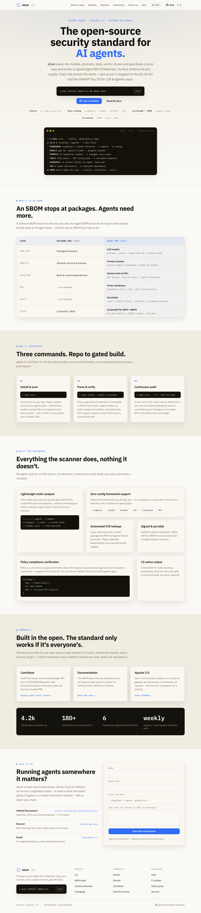

# ABOM — The Agent Bill of Materials

**abom.ai** · *The open-source security standard for AI agents.*

[](website/index.html)

<details>
<summary>Full-page preview</summary>

[](website/index.html)

</details>

```sh
pip install abom-cli && abom scan .
```

SBOMs made software supply chains accountable, and then became mandated. AI agents are next. **ABOM** is the primitive: a standard format plus the tooling to **scan**, **verify**, and **notarize** a bill of materials for agentic systems — Apache 2.0, OWASP LLM Top 10 aligned, runs entirely offline.

ABOM extends the open **CycloneDX ML-BOM** standard to full agents and runtime provenance. We open-source the format and the generator to win the standard, and monetize verification and the neutral notary.

## The two artifacts

- **Composition Manifest** — what an agent *is*: every model (with weight hashes), tool, prompt, data source, framework, and policy. Signed at deploy time.
- **Action Provenance Record** — what an agent *did*: per consequential action, the inputs, model calls, tools, data classification, policy decisions, and approvals — hash-chained, tamper-evident, linked to the composition.

## Three products around an open standard

| | |
|---|---|
| **abom-gen** | Open-source SDK / runtime hook that auto-emits ABOMs |
| **abom-verify** | Checks an ABOM against policy (unapproved models, PII egress, missing approvals, composition drift) — the paid product |
| **The Notary** | Signed, queryable, tamper-evident registry; the system of record auditors and regulators query |

## Repository

| Path | What |
|---|---|
| [mvp/](mvp/) | Runnable reference implementation ([mvp/README.md](mvp/README.md), [mvp/MVP_SPEC.md](mvp/MVP_SPEC.md)) |
| [mvp/demo/](mvp/demo/) | Self-contained demo — emit an ABOM, catch a policy violation, prove tamper-evidence |
| [website/](website/) | The abom.ai site (also served via GitHub Pages) |

## Quick start

```bash
# the demo that proves the core — no infrastructure required
cd mvp && make demo
```

Expected: a run emits a signed ABOM (Composition Manifest + hash-chained Action Provenance), **abom-verify** catches a real policy violation that a naked run hides, and tampering with any record is detected — `✓ DEMO ASSERTIONS PASSED`.

Full local stack (Postgres, Temporal, MinIO, API, worker) via `make up`; all settings use the `ABOM_` env prefix (see [mvp/.env.example](mvp/.env.example)).

## The bet

The market is racing to make agents *do more*. ABOM builds the layer that makes an agent **answerable** — *what is it made of, and what did it do?* — answered in a signed, standard, portable artifact. Underneath the software, this is a trust company, and the trust is cryptographic, not reputational.

Roadmap arc: **ABOM (accountability, now) → Proof-Carrying Actions (prevention, later)** — gating an action on a machine-checkable proof before it runs. The bill of materials is the on-ramp.

---

*ABOM is a company in formation. Documents here are frames for company formation, not investment or legal advice; regulatory positioning should be validated with qualified counsel.*
