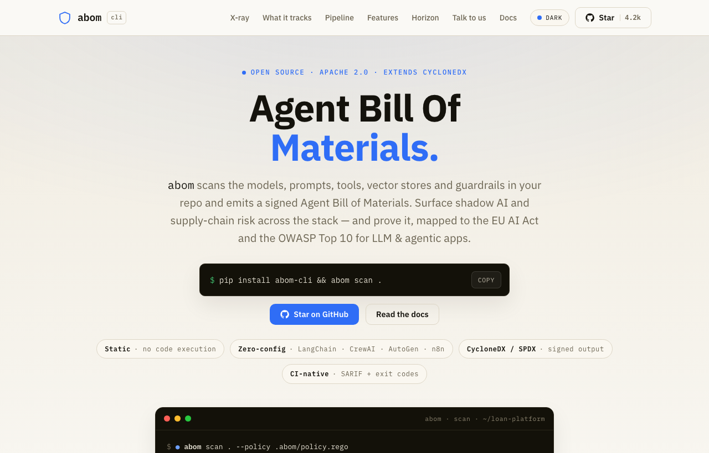

# ABOM - Agent Bill of Materials

**abom.ai** · *The open-source security standard for AI agents.*

[](https://pypi.org/project/abom-cli/)
[](LICENSE)
[](https://github.com/josephassiga/abom/actions/workflows/ci.yml)
[](spec/)
[](CONTRIBUTING.md)

[](https://abom.ai)

```sh
pip install abom-cli && abom scan .
```

Your agents ship as a black box. **ABOM develops the film.** It scans the models, prompts, tools, vector stores, and guardrails in your repo and emits a signed Agent Bill of Materials. The instant any of them is swapped, it catches the drift, re-signs, and fails the build — mapped to the EU AI Act and the OWASP Top 10 for LLM & agentic apps. Apache 2.0, runs entirely offline.

<!-- Before launch, replace this block with an asciinema/GIF demo — see LAUNCH.md -->

```text
$ abom scan .

  ABOM · langchain-support-agent
  data sources   1  Chroma
  frameworks     2  LangChain, LangGraph
  models         3  OpenAI (SDK), gpt-4o, gpt-4o-mini
  tools          2  search_orders, issue_refund
  prompts        1  prompts/system.txt
  signed: ed25519 · key 80a12d1f594d5481
  → wrote abom.json

$ abom verify abom.json --policy policy.json
  ✗ 1 finding:
      • [medium] model_allowlist (gpt-4o): declared model not on allowlist
```

See it run on real repos in [`examples/`](examples/) — LangChain and CrewAI, with committed signed ABOMs.

ABOM extends the open **CycloneDX ML-BOM** standard to full agents and runtime provenance. We open-source the format and the generator to win the standard, and monetize verification and the neutral notary.

## The two artifacts

- **Composition Manifest** — what an agent *is*: every model (with weight hashes), tool, prompt, data source, framework, and policy. Signed at deploy time.
- **Action Provenance Record** — what an agent *did*: per consequential action, the inputs, model calls, tools, data classification, policy decisions, and approvals — hash-chained, tamper-evident, linked to the composition.

## Three products around an open standard

| | |
|---|---|
| **abom-gen** | Open-source SDK / runtime hook that auto-emits ABOMs |
| **abom-verify** | Checks an ABOM against policy (unapproved models, PII egress, missing approvals, composition drift) — the paid product |
| **The Notary** | Signed, queryable, tamper-evident registry; the system of record auditors and regulators query |

## Repository

| Path | What |
|---|---|
| [spec/](spec/) | **The ABOM standard** — JSON Schema + human-readable spec + examples (extends CycloneDX ML-BOM) |
| [cli/](cli/) | **Reference implementation** — the `abom` CLI & library ([demo](cli/demo/), [spec for it](cli/MVP_SPEC.md)) |
| [examples/](examples/) | `abom scan` on real LangChain & CrewAI repos, with committed signed ABOMs |
| [docs/](docs/) | Project documents — strategy, architecture, market model |
| [website/](website/) | The abom.ai site (served via GitHub Pages) |

Open-source project files: [LICENSE](LICENSE) (Apache-2.0) · [CONTRIBUTING](CONTRIBUTING.md) · [GOVERNANCE](GOVERNANCE.md) · [SECURITY](SECURITY.md) · [CODE_OF_CONDUCT](CODE_OF_CONDUCT.md) · [CHANGELOG](CHANGELOG.md).

## Usage

```bash
pip install abom-cli

abom scan .                                   # → abom.json (signed with ed25519)
abom verify abom.json                         # check the signature
abom verify abom.json --policy policy.json    # enforce a policy (exit 1 on violations)
```

`abom scan` detects models, prompts, tools, MCP servers, frameworks, vector
stores, and guardrails from your dependencies and source — each with a
`detected_from` — and emits a [spec-valid](spec/) Composition Manifest.

### In CI (GitHub Action)

```yaml
- uses: josephassiga/abom/.github/actions/abom-scan@main
  with:
    path: .
    # policy: .abom/policy.json    # optional — fail the build on violations
```

### From source

```bash
cd cli && pip install -e ".[dev]"
make demo            # generate → verify → tamper-evidence walkthrough (no infra)
```

## The bet

The market is racing to make agents *do more*. ABOM builds the layer that makes an agent **answerable** — *what is it made of, and what did it do?* — answered in a signed, standard, portable artifact. Underneath the software, this is a trust company, and the trust is cryptographic, not reputational.

Roadmap arc: **ABOM (accountability, now) → Proof-Carrying Actions (prevention, later)** — gating an action on a machine-checkable proof before it runs. The bill of materials is the on-ramp.

## Contributing

ABOM is developed in the open under **Apache-2.0**. Spec proposals and code are
both welcome — start with [CONTRIBUTING.md](CONTRIBUTING.md) and
[GOVERNANCE.md](GOVERNANCE.md). Be kind: [Code of Conduct](CODE_OF_CONDUCT.md).
Found a security issue? See [SECURITY.md](SECURITY.md).

---

*ABOM is a company in formation. Documents here are frames for company formation, not investment or legal advice; regulatory positioning should be validated with qualified counsel.*
